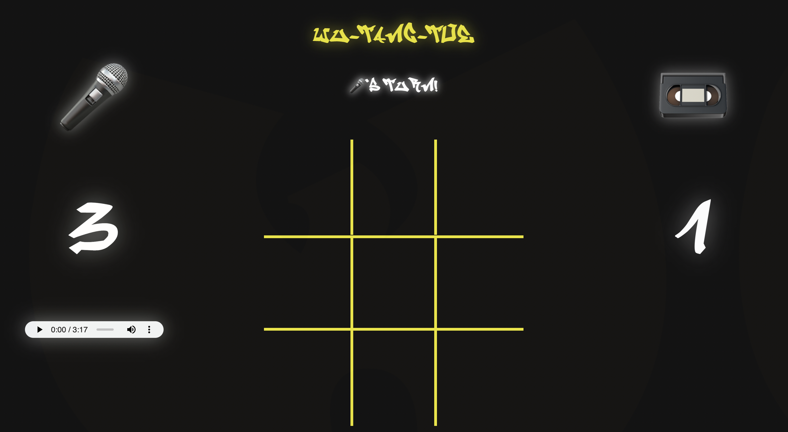

#### Contributors:
Matt Roden

#### Technology Stack:
HTML, CSS, JavaScript, Atom, Google Chrome Dev-Tools, Git, Github, GarageBand

##### Main function:

- Wu-Tang-Toe is a traditional Tic-Tac-Toe game that is meant to be played on a desktop web browser window (mobile in the future). It allows for the saving of each player's wins and stores those forever. Each player's wins will always be shown on their respective 'scoreboard'. This app also allows the users to listen to a looping Wu-Tang Clan instrumental.

##### How to Use the App:

- ##### Playng the Game:
1. Player 1 (🎤) will always go first, and will place their icon on the grid by clicking anywhere between the yellow grid lines.
2. Player 2 (📼) will then be able to place their icon anywhere in between the yellow grid lines besides where Player 1 has already.
3. Players continue to place their icons on the game board until a player has 3 of their icons in a row, or until a draw.
4. When a win happens, one win point will be added to the winning player's total wins score that is displayed on their scoreboard, and the game header will announce the winner. The game will be disabled for 3 seconds, and then a new game will be instated.
5. When a draw happens, the game board header will announce a draw, and no wins will be added to either player. Again, the game will be disabled for 3 seconds until a new game is instated.

- ##### Using the Audio Player:
The audio player is very simple. the user simply has to press the play button to start the audio. When the track is finished, it will automatically start over. This looping will be continuous until a user pauses the audio player. The audio player contains basic controls for adjusting volume, playing and pausing, and fast-forwarding and reversing through the audio file.

#### Future Iterations:

- Make scalable for different screen sizes.
- Add dynamic background to whole page.
- Change icons to Wu-Tang logo (yellow + white ones).
- Make more symantic for screen-readers.
- Make a function that randomizes who goes first.
- Add sound FX when a grid is clicked.
- Make an audio track that runs on load, is more subtle, and uses a small icon to mute, instead of using the audio player.

### Reflection:

- Challenges: Starting out the game and figuring out what needed to happen first was the biggest hurdle for me. After I decided that putting an icon on the board was the first move in the game play, things started to go smoother. Figuring out how to properly add to local storage was also a hurdle down the line.

- Wins: I feel like I wrote decently DRY code. I also learned a ton about HTML, CSS, and JS during this project. The biggest win for me was getting through the mental battles while figuring out how this game works, thinking through my logic, and writing concise functions.
